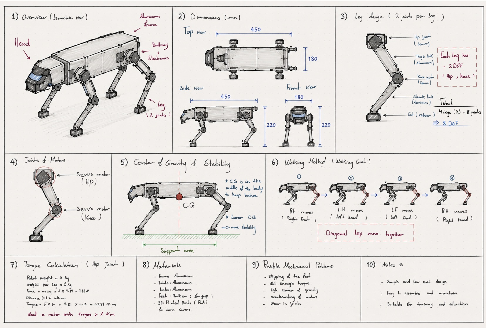

# Robot Dog Concept Design

## Overview

This repository contains my first mechanical concept design assignment for the Smart Methods Mechanical Track.

The objective of this project is to design a simple quadruped robot dog while applying the basic principles of mechanical engineering.

## Design Preview

## Design Specifications

- Number of Legs: 4
- Joints per Leg: 2
- Total Joints: 8
- Degrees of Freedom (DOF): 8
- Motor Type: DS3225 Servo Motor
- Material: Aluminum + PLA
- Walking Method: Walking Gait

## Files

- RobotDog_Sketch.png

## Course

Smart Methods – Mechanical Track
